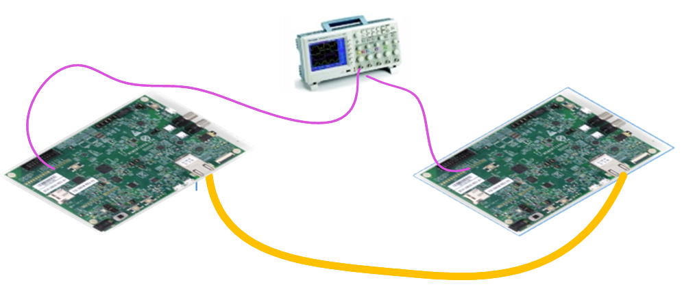
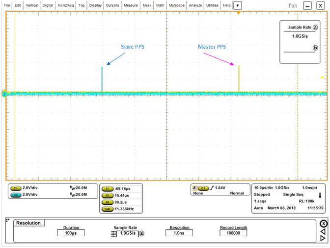
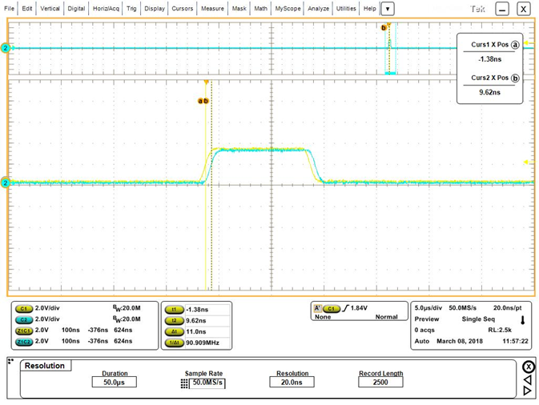
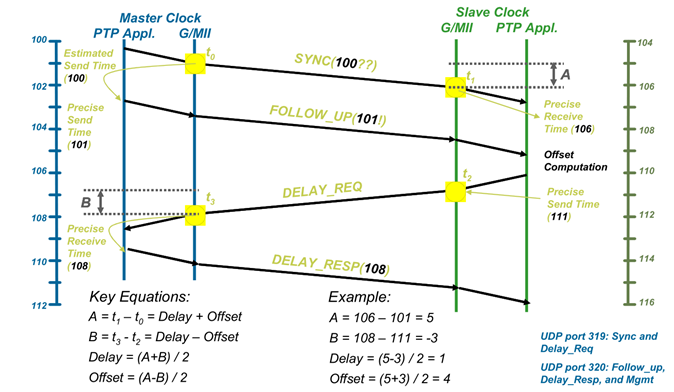

# NXP Application Code Hub

## AN12149: Implementing an IEEE 1588 V2 on i.MX RT  Using PTPd, FreeRTOS, and lwIP TCP/IP  stack

This software accompanies application note AN12149, which describes how to implementation a 1588 V2 application based on ptpd.

The software is based on MCUXpresso IDE and just enable RT1020-EVK and RT1050-EVKB. Use two boards and a ethernet cable can run the test. The board will print the log of delay information.

Please refer to AN12149 for complete instructions on how to use this software.

#### Boards: EVK-MIMXRT1020, EVKB-IMXRT1050
#### Categories: Time Sensitive Networking, Networking
#### Peripherals: ETHERNET
#### Toolchains: MCUXpresso IDE

## Table of Contents
1. [Software](#step1)
2. [Hardware](#step2)
3. [Setup](#step3)
4. [Results](#step4)
5. [FAQs](#step5) 
6. [Support](#step6)
7. [Release Notes](#step7)

## 1. Software
- SDK: 2.15.0
- IDE: MCUXpresso IDE v11.9.0

## 2. Hardware
- IMXRT1050-EVKB
- MIMXRT1020-EVK
- Ethernet Cable with RJ45 connector
- Two micro USB cable

## 3. Setup
1. Compile the project with the pre-defined macro 'PTP_APP_MASTER_TEST=1' and download it to the first board.
2. Compile the project with the pre-defined macro 'PTP_APP_MASTER_TEST=0' and download it to the sencond board.
3. Power on the two boards and connect the debug usb port to PC and open terminal tool on PC to monitor the log.
4. Connect two RJ45 ports of the two boards with an ethernet cable.
5. Follow the requirement in the AN to use the oscilloscope to monitor the two 1PPS signal output from the two boards.

## 4. Results
When the demo run successfully, the delay value in the log will tend to be stable. And in the oscilloscope, the 1PPS signal will close to each other.

## 5. FAQs
What is the synchronization principle.

## 6. Support
If you have questions, please create a ticket in NXP Community.

#### Project Metadata

<!----- Boards ----->

<!----- Categories ----->

<!----- Peripherals ----->

<!----- Toolchains ----->

Questions regarding the content/correctness of this example can be entered as Issues within this GitHub repository.

>**Warning**: For more general technical questions regarding NXP Microcontrollers and the difference in expected functionality, enter your questions on the [NXP Community Forum](https://community.nxp.com/)

## 7. Release Notes
| Version | Description / Update                           | Date                        |
|:-------:|------------------------------------------------|----------------------------:|
| 1.0     | Initial release on Application Code Hub        | February 25th 2025 |

## Licensing

## Origin

